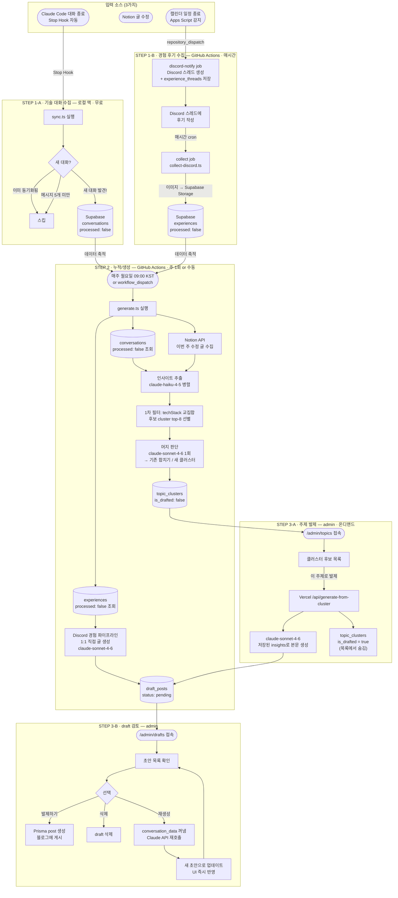
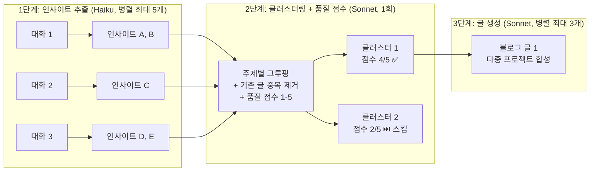
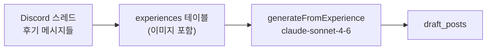
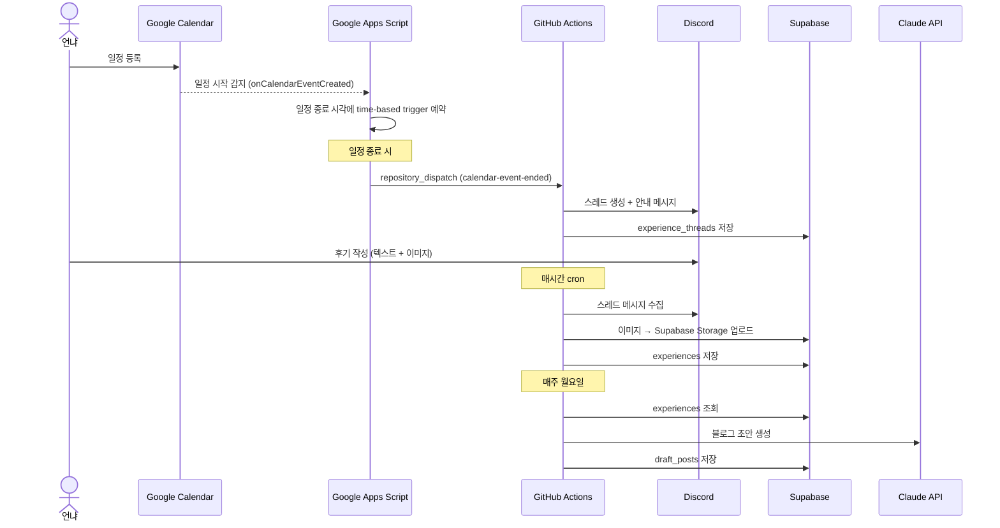
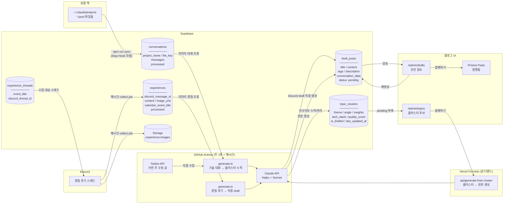
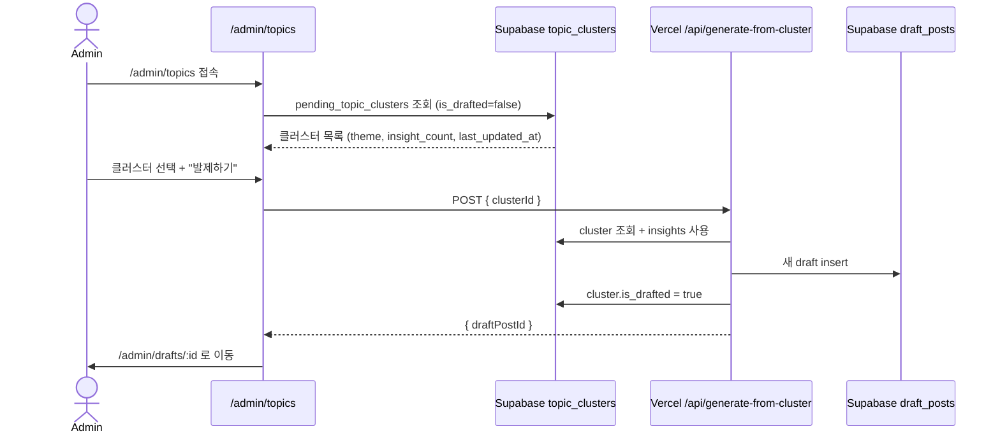
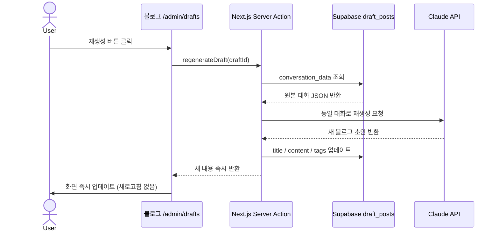

# Auto Blog Posting Pipeline

Claude Code 대화 로그, Notion 글, Discord 경험 후기를 블로그 초안으로 변환하는 파이프라인.

**핵심 아이디어**
- 기술 대화/Notion → **주제(클러스터)별 누적** → 어드민에서 "이 주제로 발제" 누르는 시점에 본문 생성
- Discord 경험 후기 → 1:1 직접 draft 생성 (별도 파이프라인)
- 매주 글이 자동 양산되어 같은 주제가 파편화되던 문제 해결

---

## 전체 파이프라인 흐름



---

## AI 처리 파이프라인 상세

### 기술 대화 파이프라인 (Claude 로그 + Notion)



**파이프라인 특징:**
- 여러 프로젝트에 걸쳐 비슷한 주제 → 하나의 깊은 글로 합성
- `cleanConversationText`로 코드블록 압축, 짧은 메시지 제거 후 Haiku 전달
- Haiku로 가치 없는 대화 사전 필터링 → 비용 절감
- Sonnet이 클러스터링 시 품질 점수(1-5) 부여 → 3점 미만은 생성 스킵
- Tool Use 강제 → JSON 파싱 오류 원천 차단
- 기존 draft_posts 제목 참조 → 중복 주제 생성 방지

### 경험 후기 파이프라인 (Discord)



**경험 후기는 필터링 없음:** 가치 판별·클러스터링을 거치지 않고 바로 블로그 글 생성. 짧은 후기라도 무조건 초안 생성.

---

## 경험 후기 자동화 흐름 (캘린더 → Discord → 블로그)



---

## 데이터 흐름



---

## 비용 구조

| 단계 | 실행 시점 | 모델 | 역할 |
|---|---|---|---|
| `sync.ts` | 대화 끝날 때마다 | 없음 | 로컬 파일 → DB |
| `collect-discord.ts` | 매시간 | 없음 | Discord 메시지 수집 + 이미지 업로드 |
| 인사이트 추출 | 주 1회 | claude-haiku-4-5 (병렬 최대 5개) | 가치 판별 + 핵심 추출 |
| 클러스터링 | 주 1회 | claude-sonnet-4-6 (1회) | 주제별 그루핑 + 품질 점수 + 중복 제거 |
| 글 생성 (기술) | 주 1회 | claude-sonnet-4-6 (병렬 최대 3개) | 블로그 초안 작성 |
| 글 생성 (경험) | 주 1회 | claude-sonnet-4-6 (병렬) | 필터링 없이 바로 초안 작성 |
| 재생성 | 버튼 클릭 시 | claude-sonnet-4-6 | 단일 초안 재작성 |

---

## GitHub Actions 구조

| Job | 트리거 | 역할 |
|---|---|---|
| `discord-notify` | `repository_dispatch` (캘린더 일정 종료) | Discord 스레드 생성 |
| `collect` | 매시간 cron / `workflow_dispatch job=collect\|all` | Discord 메시지 수집 |
| `generate` | 매주 월요일 cron / `workflow_dispatch job=generate\|all` | 기술 대화 클러스터 누적 + Discord draft 생성 (`collect` 완료 후 실행) |

`job=all`로 수동 실행 시 `collect → generate` 순서 보장 (`needs: [collect]`).

월요일 `generate` job이 하는 일:
1. Discord 경험 → 1:1 draft 직접 생성 → `draft_posts`에 저장
2. Claude 대화 + Notion → 인사이트 추출 → 기존 `topic_clusters`에 머지하거나 새 클러스터 생성
3. **본문 생성은 안 함** — admin이 [Vercel API](#vercel-api-어드민-발제용)를 호출하는 시점까지 대기

---

## 디렉토리 구조

```
auto-blog-posting/
│
├── src/
│   ├── sync.ts                 # STEP 1-A: 로컬 로그 → Supabase 동기화
│   ├── generate.ts             # STEP 2: 기술 대화 → topic_clusters 누적 / Discord → draft 직접 생성
│   ├── collect.ts              # 로컬 ~/.claude/projects/ 파일 파싱
│   ├── collect-notion.ts       # Notion API에서 글 수집
│   ├── collect-discord.ts      # STEP 1-B: Discord 스레드 메시지 수집 + 이미지 업로드
│   ├── collect-experiences.ts  # Supabase experiences 조회 → ProjectConversation 변환
│   ├── discord-notify.ts       # Discord 스레드 생성 + experience_threads 저장
│   ├── summarize.ts            # 인사이트 추출 + incremental 클러스터링 + 글 생성
│   ├── upload-drafts.ts        # Supabase draft_posts 저장
│   └── index.ts                # 로컬 전체 파이프라인 수동 실행용
│
├── api/
│   └── generate-from-cluster.ts # Vercel function: admin이 cluster 선택 시 본문 생성
│
├── apps-script/
│   └── calendar-discord.gs     # Google Apps Script: 캘린더 감지 → GitHub Actions 트리거
│
├── .github/
│   └── workflows/
│       └── blog-pipeline.yml   # 3개 job: discord-notify / collect / generate
│
├── sql/
│   └── schema.sql              # Supabase 테이블 생성 SQL (topic_clusters 포함)
│
├── vercel.json                 # Vercel function 설정
├── setup-hook.sh               # Claude Code Stop Hook 등록 스크립트
└── .env                        # 환경변수 (절대 커밋 금지!)
```

---

## 초기 설정 방법

### 1. 환경변수 설정

`.env` 파일 생성:

```env
# Claude API
ANTHROPIC_API_KEY=sk-ant-...

# Supabase
SUPABASE_URL=https://xxxx.supabase.co
SUPABASE_SERVICE_ROLE_KEY=eyJ...

# Notion (선택)
NOTION_API_KEY=secret_...
NOTION_PAGE_IDS=page_id1,page_id2
NOTION_DATABASE_IDS=db_id1

# Discord (경험 후기 파이프라인)
DISCORD_BOT_TOKEN=...
DISCORD_EXPERIENCE_CHANNEL_IDS=channel_id1,channel_id2

# Google Calendar (경험 후기 파이프라인)
GOOGLE_CLIENT_ID=...
GOOGLE_CLIENT_SECRET=...
GOOGLE_REFRESH_TOKEN=...
GOOGLE_CALENDAR_ID=...@group.calendar.google.com
```

### 2. Supabase 테이블 생성

Supabase 대시보드 → SQL Editor → `sql/schema.sql` 내용 실행

경험 후기 파이프라인을 사용한다면 Supabase Storage에 `experience-images` 버킷도 생성 (Public).

### 3. 의존성 설치

```bash
npm install
```

### 4. Stop Hook 등록 (최초 1회)

```bash
bash setup-hook.sh
```

Claude Code 대화가 끝날 때마다 `sync.ts`가 백그라운드에서 자동 실행됩니다.
기존에 등록된 다른 Stop Hook은 유지되며, 중복 실행해도 안전합니다.

### 5. GitHub 레포 Secrets 등록

레포 → Settings → Secrets and variables → Actions:

```
# 필수
ANTHROPIC_API_KEY
SUPABASE_URL
SUPABASE_SERVICE_ROLE_KEY

# Notion (선택)
NOTION_API_KEY
NOTION_PAGE_IDS
NOTION_DATABASE_IDS

# Discord 경험 후기 (선택)
DISCORD_BOT_TOKEN
DISCORD_EXPERIENCE_CHANNEL_IDS

# Google Calendar 연동 (선택)
GOOGLE_CLIENT_ID
GOOGLE_CLIENT_SECRET
GOOGLE_REFRESH_TOKEN
GOOGLE_CALENDAR_ID
```

### 6. Google Apps Script 설정 (경험 후기 파이프라인)

1. [Google Apps Script](https://script.google.com) → 새 프로젝트
2. `apps-script/calendar-discord.gs` 내용 붙여넣기
3. 스크립트 상단 상수 설정:
   ```javascript
   const GITHUB_TOKEN = "ghp_...";  // repo scope 필요
   const GITHUB_REPO = "username/auto-blog-posting";
   const CALENDAR_ID = "...@group.calendar.google.com";
   ```
4. `onCalendarEventCreated` 함수에 캘린더 트리거 등록 (캘린더 업데이트 시 실행)
5. 배포 → 웹 앱으로 배포

### 7. 블로그 Vercel 환경변수 추가

Vercel 대시보드 → 블로그 프로젝트 → Settings → Environment Variables:

```
ANTHROPIC_API_KEY=sk-ant-...
```

---

## 수동 실행 명령어

```bash
# 로컬 로그를 Supabase에 동기화
npm run sync

# Discord 스레드 메시지 수집
npm run collect:discord

# 미처리 대화 + 경험으로 블로그 초안 생성
npm run generate

# 특정 이벤트로 Discord 스레드 수동 생성
EVENT_TITLE="일정 이름" npm run discord:notify
```

---

## GitHub Actions 실행 방법

GitHub 레포 → **Actions** 탭 → **블로그 초안 자동 생성** → **Run workflow**

| `job` 입력값 | 동작 |
|---|---|
| `all` (기본) | collect → generate 순서로 실행 |
| `collect` | Discord 메시지 수집만 |
| `generate` | 블로그 초안 생성만 |

실행 결과는 Actions → 해당 실행 → **Job Summary**에서 생성된 초안 목록 확인 가능.

---

## Vercel API (어드민 발제용)

`POST /api/generate-from-cluster` — 어드민이 클러스터 하나 선택해서 본문 생성할 때 호출.

```bash
curl -X POST https://<your-vercel-domain>/api/generate-from-cluster \
  -H "Authorization: Bearer $GENERATE_API_TOKEN" \
  -H "Content-Type: application/json" \
  -d '{"clusterId": 42}'
```

**응답**
```json
{ "draftPostId": 17, "title": "Next.js App Router 도입 회고" }
```

**동작 순서**
1. `topic_clusters`에서 `clusterId`로 row 조회 (`is_drafted=true`면 409)
2. 저장된 insights로 Claude Sonnet 본문 생성
3. `draft_posts`에 insert (`status: pending`)
4. 해당 클러스터를 `is_drafted=true`, `drafted_post_id=...`로 마킹
5. admin은 발제된 draft를 [기존 재생성 흐름](#재생성-동작-방식)으로 검토/발행

**배포**
```bash
# 처음 한 번
npx vercel link

# 환경변수 설정 (Vercel 대시보드에서 또는 CLI)
npx vercel env add ANTHROPIC_API_KEY production
npx vercel env add SUPABASE_URL production
npx vercel env add SUPABASE_SERVICE_ROLE_KEY production
npx vercel env add GENERATE_API_TOKEN production  # 임의 시크릿 (blog-site와 공유)

npx vercel --prod
```

`GENERATE_API_TOKEN`은 blog-site 환경변수에도 같은 값으로 등록해서 server action에서 호출할 때 `Authorization: Bearer $TOKEN` 헤더에 실어 보냄.

---

## 어드민 흐름 (blog-site 측 작업 — 별도 레포)



---

## 재생성 동작 방식


