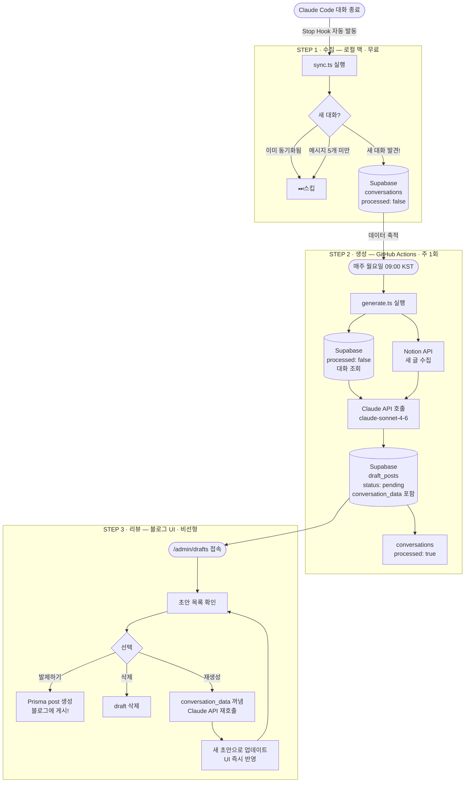
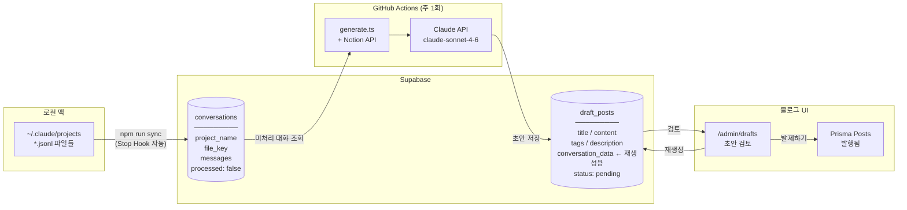
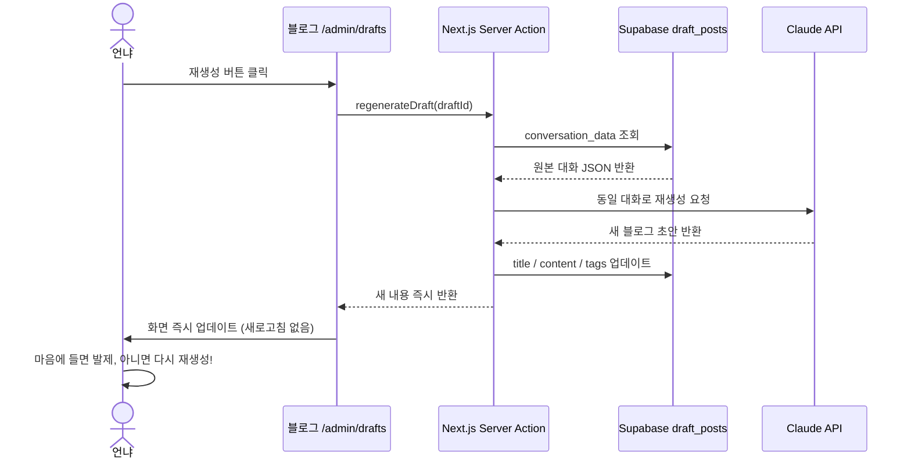

# Auto Blog Posting Pipeline

Claude Code 대화 로그와 Notion 글을 자동으로 블로그 초안으로 변환하는 파이프라인.

---

## 전체 파이프라인 흐름



---

## 데이터 흐름



---

## 비용 구조

| 단계          | 실행 시점        | Claude API | 비용        |
| ------------- | ---------------- | ---------- | ----------- |
| `sync.ts`     | 대화 끝날 때마다 | 없음       | 거의 0      |
| `generate.ts` | 주 1회           | 사용       | 주 1회만    |
| 재생성        | 버튼 클릭 시     | 사용       | 필요할 때만 |

---

## 디렉토리 구조

```
auto-blog-posting/
│
├── src/
│   ├── sync.ts            # STEP 1: 로컬 로그 → Supabase 동기화
│   ├── generate.ts        # STEP 2: Supabase 대화 → 블로그 초안 생성
│   ├── collect.ts         # 로컬 ~/.claude/projects/ 파일 파싱
│   ├── collect-notion.ts  # Notion API에서 글 수집
│   ├── summarize.ts       # Claude API 호출 + 블로그 스타일 프롬프트
│   ├── upload-drafts.ts   # Supabase draft_posts 저장
│   └── index.ts           # 로컬 전체 파이프라인 수동 실행용
│
├── .github/
│   └── workflows/
│       └── blog-pipeline.yml  # 매주 월요일 자동 실행
│
├── sql/
│   └── schema.sql         # Supabase 테이블 생성 SQL
│
├── setup-hook.sh          # Claude Code Stop Hook 등록 스크립트
└── .env                   # 환경변수 (절대 커밋 금지!)
```

---

## 초기 설정 방법

### 1. 환경변수 설정

`.env` 파일 생성:

```env
ANTHROPIC_API_KEY=sk-ant-...
SUPABASE_URL=https://xxxx.supabase.co
SUPABASE_SERVICE_ROLE_KEY=eyJ...
NOTION_API_KEY=secret_...
NOTION_DATABASE_ID=...
```

### 2. Supabase 테이블 생성

Supabase 대시보드 → SQL Editor → `sql/schema.sql` 내용 실행

### 3. 의존성 설치

```bash
npm install
```

### 4. Stop Hook 등록 (최초 1회)

```bash
bash setup-hook.sh
```

Claude Code 대화가 끝날 때마다 `sync.ts`가 백그라운드에서 자동 실행됨.

### 5. GitHub 레포 생성 후 Secrets 등록

레포 → Settings → Secrets and variables → Actions:

```
ANTHROPIC_API_KEY
SUPABASE_URL
SUPABASE_SERVICE_ROLE_KEY
NOTION_API_KEY
NOTION_DATABASE_ID
```

### 6. 블로그 Vercel 환경변수 추가

Vercel 대시보드 → 블로그 프로젝트 → Settings → Environment Variables:

```
ANTHROPIC_API_KEY=sk-ant-...
```

---

## 수동 실행 명령어

```bash
# 로컬 로그를 Supabase에 동기화
npm run sync

# 미처리 대화로 블로그 초안 생성
npm run generate

# 로컬에서 전체 파이프라인 한 번에 실행
npm run start
```

---

## GitHub Actions 스케줄

- 실행 시점: **매주 월요일 오전 9시 KST** (UTC 0:00)
- 수동 실행: GitHub 레포 → Actions 탭 → `블로그 초안 자동 생성` → `Run workflow`

---

## 재생성 동작 방식


