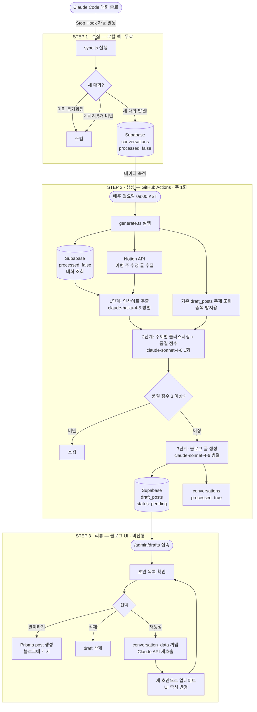
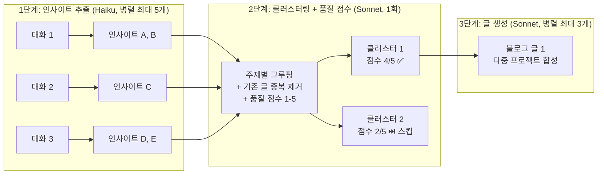
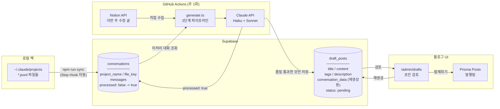
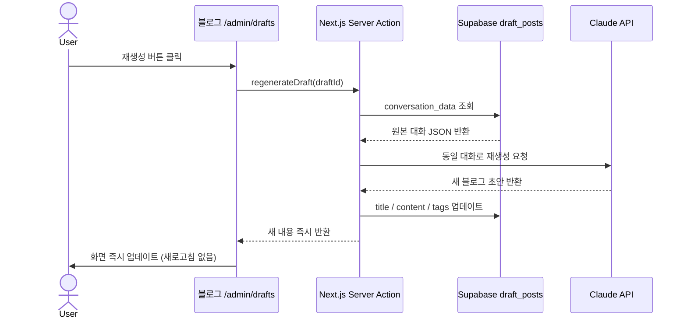

# Auto Blog Posting Pipeline

Claude Code 대화 로그와 Notion 글을 자동으로 블로그 초안으로 변환하는 파이프라인.

---

## 전체 파이프라인 흐름



---

## AI 처리 파이프라인 상세



**파이프라인 특징:**
- 여러 프로젝트에 걸쳐 비슷한 주제 → 하나의 깊은 글로 합성
- Haiku로 가치 없는 대화 사전 필터링 → 비용 절감
- Sonnet이 클러스터링 시 품질 점수(1-5) 부여 → 3점 미만은 생성 스킵
- 대화 텍스트 균등 샘플링 → 중간 핵심 내용 손실 방지
- Tool Use 강제 → JSON 파싱 오류 원천 차단
- 기존 draft_posts 제목 참조 → 중복 주제 생성 방지

---

## 데이터 흐름



---

## 비용 구조

| 단계 | 실행 시점 | 모델 | 역할 |
|---|---|---|---|
| `sync.ts` | 대화 끝날 때마다 | 없음 | 로컬 파일 → DB |
| 인사이트 추출 | 주 1회 | claude-haiku-4-5 (병렬 최대 5개) | 대화 가치 판별 + 핵심 추출 |
| 클러스터링 | 주 1회 | claude-sonnet-4-6 (1회) | 주제별 그루핑 + 품질 점수 + 중복 제거 |
| 글 생성 | 주 1회 | claude-sonnet-4-6 (병렬 최대 3개) | 블로그 초안 작성 |
| 재생성 | 버튼 클릭 시 | claude-sonnet-4-6 | 단일 초안 재작성 |

---

## 디렉토리 구조

```
auto-blog-posting/
│
├── src/
│   ├── sync.ts            # STEP 1: 로컬 로그 → Supabase 동기화
│   ├── generate.ts        # STEP 2: Supabase 대화 → 블로그 초안 생성
│   ├── collect.ts         # 로컬 ~/.claude/projects/ 파일 파싱
│   ├── collect-notion.ts  # Notion API에서 글 수집
│   ├── summarize.ts       # 인사이트 추출 + 클러스터링 + 글 생성
│   ├── upload-drafts.ts   # Supabase draft_posts 저장
│   └── index.ts           # 로컬 전체 파이프라인 수동 실행용
│
├── .github/
│   └── workflows/
│       └── blog-pipeline.yml  # 매주 월요일 자동 실행
│
├── sql/
│   └── schema.sql         # Supabase 테이블 생성 SQL
│
├── setup-hook.sh          # Claude Code Stop Hook 등록 스크립트
└── .env                   # 환경변수 (절대 커밋 금지!)
```

---

## 초기 설정 방법

### 1. 환경변수 설정

`.env` 파일 생성:

```env
ANTHROPIC_API_KEY=sk-ant-...
SUPABASE_URL=https://xxxx.supabase.co
SUPABASE_SERVICE_ROLE_KEY=eyJ...
NOTION_API_KEY=secret_...
NOTION_PAGE_IDS=page_id1,page_id2
NOTION_DATABASE_IDS=db_id1  # 선택사항
```

### 2. Supabase 테이블 생성

Supabase 대시보드 → SQL Editor → `sql/schema.sql` 내용 실행

### 3. 의존성 설치

```bash
npm install
```

### 4. Stop Hook 등록 (최초 1회)

```bash
bash setup-hook.sh
```

Claude Code 대화가 끝날 때마다 `sync.ts`가 백그라운드에서 자동 실행됩니다.
기존에 등록된 다른 Stop Hook은 유지되며, 중복 실행해도 안전합니다.

### 5. GitHub 레포 Secrets 등록

레포 → Settings → Secrets and variables → Actions:

```
ANTHROPIC_API_KEY
SUPABASE_URL
SUPABASE_SERVICE_ROLE_KEY
NOTION_API_KEY
NOTION_PAGE_IDS
NOTION_DATABASE_IDS  # 선택사항
```

### 6. 블로그 Vercel 환경변수 추가

Vercel 대시보드 → 블로그 프로젝트 → Settings → Environment Variables:

```
ANTHROPIC_API_KEY=sk-ant-...
```

---

## 수동 실행 명령어

```bash
# 로컬 로그를 Supabase에 동기화
npm run sync

# 미처리 대화로 블로그 초안 생성
npm run generate
```

---

## GitHub Actions 스케줄

- 실행 시점: 매주 월요일 오전 9시 KST (UTC 0:00)
- 수동 실행: GitHub 레포 → Actions 탭 → 블로그 초안 자동 생성 → Run workflow
- 실행 결과는 Actions 탭 → 해당 실행 → Job Summary에서 생성된 초안 목록 확인 가능

---

## 재생성 동작 방식


